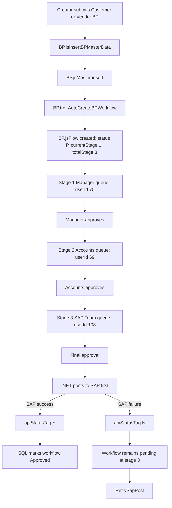
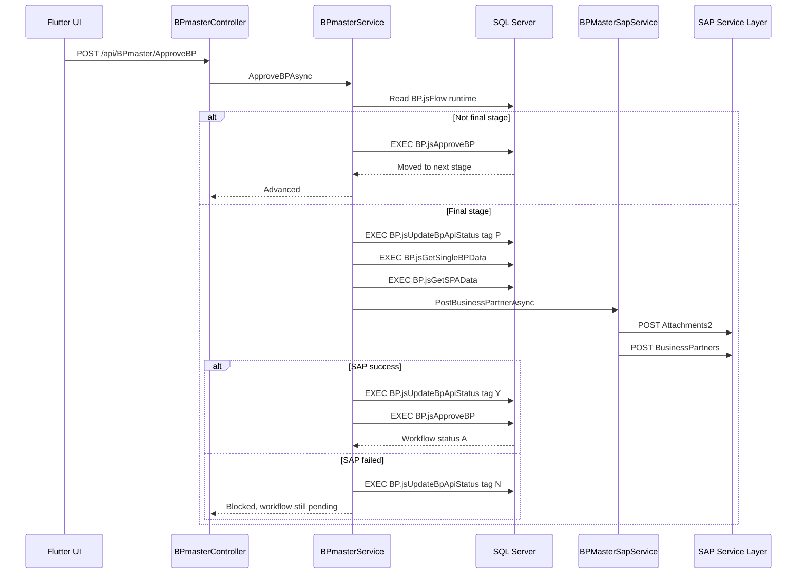

# BP Master Frontend and Backend Complete Guide

## Audience

This guide is written for Flutter frontend developers, .NET backend developers, QA testers, SAP support users, future maintainers, interns, and AI-assisted development agents working on the BP Master module in `JSAPNEW`.

The goal is simple: a developer should be able to understand, build, test, debug, and maintain the BP Master workflow by reading this document.

## 1. Module Overview

### What Is BP Master?

BP Master means Business Partner Master. In SAP Business One, a Business Partner is a person or organization that the company does business with.

In this project, BP Master supports:

| BP Type | Meaning | SAP `CardType` | Example |
|---|---|---|---|
| Customer BP | Party that buys from the company | `cCustomer` | Canola oil distributor, regional dealer, retail chain |
| Vendor BP | Party that supplies to the company | `cSupplier` | Bottle supplier, packaging vendor, transport vendor |

### Why This Module Exists

Directly creating BP records in SAP can cause master-data quality problems. A wrong GST number, PAN, bank account, group code, or payment term can affect invoices, payments, tax reporting, and audit.

This portal module solves these problems:

| Problem | How BP Master solves it |
|---|---|
| Uncontrolled SAP master creation | Users submit requests into workflow instead of directly creating SAP BPs. |
| Missing business review | Manager approval verifies business need and party information. |
| Wrong tax or bank data | Accounts approval verifies PAN, GST, MSME, FSSAI, bank, and payment terms. |
| Wrong SAP setup | SAP Team verifies final SAP fields and posts to Service Layer. |
| Duplicate or partial posting | SAP-first final approval and API status tags keep workflow consistent. |
| No audit trail | `BP.jsFlowStatus`, snapshot tables, and audit procedures retain history. |

### Why Approval Is Needed

BP creation affects finance, taxation, sales, purchasing, credit control, and SAP reporting. This is why the module uses a 3-stage workflow:

| Stage | Approver | Role | Responsibility |
|---:|---:|---|---|
| 1 | `userId = 70` | Manager Approval | Verify business need and basic BP information. |
| 2 | `userId = 69` | Accounts Approval | Verify tax, bank, payment, credit, and compliance data. |
| 3 | `userId = 108` | SAP Team Final Approval | Verify SAP readiness and trigger SAP Business Partner creation. |

### Why SAP-First Final Approval Is Used

The workflow must never show a BP as approved if SAP did not create the Business Partner.

Correct final-stage rule:

```text
Final approver clicks approve
-> .NET sets apiStatusTag = P
-> .NET calls SAP Service Layer
-> if SAP success:
      apiStatusTag = Y
      BP.jsApproveBP marks workflow approved
   if SAP fail:
      apiStatusTag = N
      workflow remains pending at stage 3
      retry allowed
```

This protects business users from seeing false approvals.

## 2. Complete Workflow Explanation

### High-Level Flow



### Submission Flow

1. Flutter submits multipart form data to `POST /api/BPmaster/InsertBPmasterData`.
2. The request contains a JSON field named `requests`.
3. Files are uploaded as multipart files.
4. File type labels are passed in a comma-separated form field named `fileTypes`.
5. Backend saves files under `wwwroot/Uploads/BPmaster`.
6. Backend calls `[BP].[jsInsertBPMasterData]`.
7. SQL inserts master, tax, addresses, bank details, contacts, and attachments.
8. Insert into `BP.jsMaster` fires `[BP].[trg_AutoCreateBPWorkflow]`.
9. Trigger creates `BP.jsFlow` with the configured approval template.

### Approval Flow

| Step | Current stage | User who sees pending | API | SQL result |
|---:|---:|---:|---|---|
| 1 | 1 | `70` | `ApproveBP` | `BP.jsFlow.currentStage` moves to `2`. |
| 2 | 2 | `69` | `ApproveBP` | `BP.jsFlow.currentStage` moves to `3`. |
| 3 | 3 | `108` | `ApproveBP` | .NET posts SAP first, then SQL approves only if SAP succeeded. |

### SAP Posting Flow



### Rejection Flow

Any active approver assigned to the current stage can reject.

```text
Approver clicks reject
-> POST /api/BPmaster/RejectBP
-> BPmasterService calls BP.jsRejectBP
-> BP.jsFlow.status = R
-> BP.jsFlowStatus stores rejection row with remarks
```

Frontend should require rejection remarks.

### Pending Flow

`GetPendingBP` only returns records for the user's current stage. This is controlled by:

```sql
BP.jsFlow.currentStageId = dbo.jsUserStage.stageId
AND dbo.jsUserStage.userId = @userId
AND dbo.jsUserStage.status = 1
```

This means:

| User | Sees pending when |
|---:|---|
| `70` | BP is at stage 1. |
| `69` | BP is at stage 2. |
| `108` | BP is at stage 3. |

### Retry Flow

Retry is only for SAP failure at final stage.

```text
Stage 3 SAP post fails
-> BP.jsSAPData.apiStatusTag = N
-> BP.jsFlow.status stays P
-> currentStage stays 3
-> GetPendingBP returns canRetrySap = true
-> SAP Team user clicks Retry
-> POST /api/BPmaster/RetrySapPost
```

## 3. Database Structure

### Core Tables

| Table | Purpose | Important columns |
|---|---|---|
| `BP.jsMaster` | Main BP header data. | `code`, `type`, `name`, `company`, `groupID`, `mainGroupID`, `chain`, `paymentTermID`, `creditLimit`, `priceList`, `userId`, `companyByUser` |
| `BP.jsFlow` | Runtime workflow state. | `id`, `bpCode`, `status`, `currentStageId`, `templateId`, `totalStage`, `currentStage`, `createdOn`, `updatedOn` |
| `BP.jsFlowStatus` | Stage action history. | `flowId`, `status`, `stageId`, `templateId`, `userId`, `createdOn`, `description` |
| `BP.jsSAPData` | SAP posting metadata. | `masterId`, `debPayAcct`, `wtLabel`, `series`, `grpCode`, `apiStatusTag`, `apiMessage`, `sapCardCode`, `sapAttachmentEntry`, `payloadHash`, `retryCount`, `lastAttemptOn`, `lastAttemptBy` |
| `BP.jsMasterAddress` | BP address records. This is the actual address table. | `code`, `addressType`, `addressLine1`, `stateID`, `cityID`, `pincode`, `countryID`, `gstNo`, `isDefault`, `addressUid` |
| `BP.jsContactPersons` | Contact persons for BP. | `code`, `firstName`, `lastName`, `designation`, `email`, `phone`, `telephone`, `isPrimary`, `contactUid` |
| `BP.jsBankDetails` | Bank information, mainly required for vendors. | `code`, `name`, `accountNo`, `ifscCode`, `countryID`, `acctName`, `branch`, `swiftCode` |
| `BP.jsTaxDetails` | Tax and compliance fields. | `code`, `buyerTANNo`, `panNo`, `fssaiNo`, `msmeNo`, `msmeType`, `msmeBusinessType` |
| `BP.jsAttachments` | Uploaded document metadata. | `code`, `fileName`, `filePath`, `fileSize`, `contentType`, `fileType` |

Note: Some older notes call the address table `BP.jsAddress`. In this project the actual table is `BP.jsMasterAddress`.

### Workflow Configuration Tables

| Table | Purpose |
|---|---|
| `dbo.jsTemplate` | Approval template per company/module. |
| `dbo.jsTemplateQuery` | Links template to validation query. |
| `dbo.jsQuery` | Query used by trigger to pick the matching template. BP uses `type = 10`. |
| `dbo.jsStageTemplate` | Maps a stage to a template and priority. |
| `dbo.jsStage` | Stage definition, approval count, rejection count, description. |
| `dbo.jsUserStage` | Maps approver users to stage IDs. |
| `dbo.jsApprovalCount` | Number of approvals required at a stage. |
| `dbo.jsRejectionCount` | Number of rejections required. |

### Snapshot and Audit Tables

| Table | Purpose |
|---|---|
| `BP.jsAuditLog` | Field-level change audit. |
| `BP.jsMasterSnapshot` | Master header snapshot. |
| `BP.jsMasterAddressSnapshot` | Address snapshot. |
| `BP.jsBankDetailsSnapshot` | Bank detail snapshot. |
| `BP.jsContactPersonsSnapshot` | Contact snapshot. |
| `BP.jsAttachmentsSnapshot` | Attachment snapshot. |
| `BP.jsTaxDetailsSnapshot` | Tax detail snapshot. |

Related SQL procedures:

| Procedure | Purpose | API exposed today |
|---|---|---|
| `BP.jsGetBPCompleteAuditLog` | Full field-change and snapshot audit view. | Not currently exposed in `BPmasterController`. |
| `BP.jsGetBPSnapshots` | Snapshot list by BP code/date. | Not currently exposed. |
| `BP.jsRestoreBPFromSnapshot` | Restore BP from snapshot with confirmation flag. | Not currently exposed. |

Recommended future API routes:

```text
GET  /api/BPmaster/GetBPCompleteAuditLog?bpCode=12001
GET  /api/BPmaster/GetBPSnapshots?bpCode=12001
POST /api/BPmaster/RestoreBPFromSnapshot
```

## 4. Approval Engine

### How `currentStage` Works

`BP.jsFlow.currentStage` is the numeric stage priority:

| Value | Meaning |
|---:|---|
| `1` | Manager Approval |
| `2` | Accounts Approval |
| `3` | SAP Team Final Approval |

### How `totalStage` Works

`BP.jsFlow.totalStage` is the number of stages in the template. Current production design requires:

```text
totalStage = 3
```

The .NET service treats a BP as final when:

```csharp
CurrentStage >= TotalStage
```

This is why `totalStage` must be correct. If `totalStage = 1`, SAP posting starts after the first approval.

### How Next Approver Is Detected

`GetPendingBP` checks:

```sql
SELECT DISTINCT us.stageId
FROM dbo.jsUserStage us
JOIN dbo.jsStageTemplate st ON us.stageId = st.stageId
JOIN dbo.jsTemplate t ON st.templateId = t.id
WHERE us.userId = @userId
  AND t.company = @companyId
  AND t.isActive = 1
  AND ISNULL(us.status, 1) = 1;
```

Then it matches those stage IDs against `BP.jsFlow.currentStageId`.

### How Stage Movement Works

`BP.jsApproveBP`:

1. Loads `BP.jsFlow`.
2. Validates BP company.
3. Resolves current stage from `jsStageTemplate`.
4. Checks whether `@userId` is assigned to the current stage.
5. Inserts or updates `BP.jsFlowStatus`.
6. Counts approvals required from `jsApprovalCount`.
7. If current stage is not final, moves `currentStage` and `currentStageId` forward.
8. If current stage is final, refuses approval unless SAP status is `Y`.

Stage movement example:

```sql
SELECT
    f.id AS flowId,
    f.bpCode,
    f.status,
    f.currentStage,
    f.totalStage,
    f.currentStageId,
    s.stage AS currentStageName
FROM BP.jsFlow f
LEFT JOIN dbo.jsStage s ON s.id = f.currentStageId
WHERE f.id = 1115;
```

## 5. SAP Integration

### SAP Service Layer

The backend posts to SAP Business One Service Layer through `BPMasterSapService`.

Important SAP endpoints:

| Endpoint | Method | Purpose |
|---|---|---|
| `BusinessPartners?$filter=...` | GET | Find latest CardCode by prefix. |
| `Attachments2` | POST | Upload SAP-readable attachment paths. |
| `BusinessPartners` | POST | Create customer/vendor BP. |

### SAP Company Session Mapping

`BPMasterSapService.GetSessionAsync` chooses SAP login based on BP company:

| Company | Session method |
|---:|---|
| `1` | `GetSAPSessionOilAsync()` |
| `2` | `GetSAPSessionBevAsync()` |
| `3` | `GetSAPSessionMartAsync()` |

Unsupported company IDs throw an exception.

### SAP Status Tags

| Tag | Meaning | Workflow behavior |
|---|---|---|
| `P` | Processing | SAP posting has started. Prevent duplicate concurrent posts. |
| `Y` | Success | SAP created BP. SQL final approval can complete. |
| `N` | Failed | SAP failed. Workflow remains pending at stage 3. Retry allowed. |

### CardCode Generation

Default prefixes:

| BP Type | SAP CardType | Default prefix |
|---|---|---|
| Customer | `cCustomer` | `CUSTA` |
| Vendor | `cSupplier` | `VENDA` |

If `BP.jsSAPData.series` contains a non-numeric value, it can be used as the prefix.

The service queries SAP:

```http
GET /BusinessPartners?$filter=startswith(CardCode,'CUSTA') and CardType eq 'cCustomer'&$select=CardCode&$orderby=CardCode desc&$top=1
```

Then it increments the numeric suffix.

### SAP BusinessPartners Header Mapping

| Source | SAP field | Notes |
|---|---|---|
| Generated code | `CardCode` | Example `CUSTA000001`. |
| `BP.jsMaster.name` | `CardName` | BP display name in SAP. |
| `BP.jsMaster.type` | `CardType` | `C` -> `cCustomer`, `V` -> `cSupplier`. |
| Fixed value | `Currency` | `INR`. |
| `BP.jsMaster.mobileNo` | `Phone1` | Sanitized to digits, Indian mobile normalized. |
| `BP.jsMaster.creditLimit` | `CreditLimit` | Only if greater than zero. |
| `BP.jsMaster.groupID` or `BP.jsSAPData.grpCode` | `GroupCode` | Group must exist in SAP. |
| `BP.jsMaster.paymentTermID` | `PayTermsGrpCode` | Payment term group code. |
| SAP `Attachments2.AbsoluteEntry` | `AttachmentEntry` | Only if attachments were uploaded. |
| `BP.jsMaster.mainGroupID` | `U_Main_Group` | SAP UDF. |
| `BP.jsMaster.chain` | `U_Chain` | SAP UDF. |
| `BP.jsTaxDetails.fssaiNo` | `U_Fssai` | Uppercase. |
| `BP.jsTaxDetails.msmeNo` | `U_MSME` | Uppercase. |
| `BP.jsTaxDetails.msmeType` | `U_MSME_Type` | Normalized. |
| `BP.jsTaxDetails.msmeBusinessType` | `U_MSME_BType` | Normalized. |
| `BP.jsSAPData.debPayAcct` | `DebitorAccount` | Set when available. |

### BPAddresses Mapping

| Source | SAP field | Rule |
|---|---|---|
| `addressUid` or generated name | `AddressName` | Required for tax linking. |
| `addressType` | `AddressType` | Billing -> `bo_BillTo`, Shipping -> `bo_ShipTo`. |
| `addressLine1` | `Street` | Truncated to 100 chars. |
| `addressLine2` | `Block` | Truncated to 100 chars. |
| `cityID` | `City` | Truncated to 100 chars. |
| `pincode` | `ZipCode` | Truncated to 20 chars. |
| `stateID` | `State` | Mapped to SAP state code. |
| `countryID` | `Country` | Defaults to `IN`. |
| `gstNo` | `GSTIN` | Only if valid GST format. |
| valid GST | `GstType` | `gstRegularTDSISD`. |

If no shipping address exists, bill-to address is reused as ship-to.

### ContactEmployees Mapping

| Source | SAP field |
|---|---|
| `firstName + lastName` | `Name` |
| `firstName` | `FirstName` |
| `lastName` | `LastName` |
| `phone` | `MobilePhone` |
| `email` | `E_Mail` |
| fixed value | `Active = tYES` |

### BPFiscalTaxIDCollection Mapping

| Source | SAP field |
|---|---|
| First bill-to `AddressName` | `Address` |
| fixed value | `AddrType = bo_BillTo` |
| `panNo` | `TaxId0` |

PAN must match:

```text
^[A-Z]{5}[0-9]{4}[A-Z]$
```

### BPBankAccounts Mapping

Bank accounts are posted for vendors.

| Source | SAP field |
|---|---|
| `bankCode` | `BankCode` |
| `accountNo` | `AccountNo` |
| `branch` | `Branch` |
| `acctName` or bank name | `AccountName` |
| `ifscCode` | `BICSwiftCode`, `UserNo1` |
| `swiftCode` | `IBAN` |

If bank code is missing, that bank row is skipped and a warning is appended to the SAP result message.

### Attachments2 Flow

1. Portal saves file metadata in `BP.jsAttachments`.
2. `BPMasterSapService` resolves a SAP-readable source path.
3. Service posts:

```json
{
  "Attachments2_Lines": [
    {
      "FileName": "gst_certificate",
      "FileExtension": "pdf",
      "SourcePath": "\\\\sap-share\\BPmaster",
      "UserID": "1",
      "Override": "tYES"
    }
  ]
}
```

4. SAP returns `AbsoluteEntry`.
5. Backend sends `AttachmentEntry` in the `BusinessPartners` payload.

### Payload Hash

The SAP payload JSON is hashed with SHA-256. The hash is stored in `BP.jsSAPData.payloadHash`.

Use it to compare retries:

```sql
SELECT masterId, apiStatusTag, payloadHash, retryCount, lastAttemptOn
FROM BP.jsSAPData
WHERE masterId = 12001;
```

## 6. Complete API Documentation

Base route:

```text
/api/BPmaster
```

Common headers:

| Header | Value |
|---|---|
| `Authorization` | `Bearer <jwt-token>` when API authorization is enforced. |
| `Content-Type` | `application/json` for normal APIs. |
| `Content-Type` | `multipart/form-data` for create/update with files. |

The project configures JWT authentication in `Program.cs`. Individual BP endpoints currently do not show `[Authorize]` attributes in the controller, so deployment security may depend on routing, gateway, or future attributes. Frontend should still send the bearer token consistently.

### API Summary

| API | Method | Purpose | Stored procedure or service |
|---|---|---|---|
| `/InsertBPmasterData` | POST multipart | Create Customer/Vendor BP request. | `BP.jsInsertBPMasterData` |
| `/GetPendingBP` | GET | Current user's pending approval queue. | `BP.jsGetPendingBP` |
| `/ApproveBP` | POST JSON | Approve current stage. Final stage posts SAP first. | `BPmasterService`, `BP.jsApproveBP` |
| `/RejectBP` | POST JSON | Reject current stage. | `BP.jsRejectBP` |
| `/RetrySapPost` | POST JSON | Retry final-stage SAP failure. | `RetrySapPostAsync` |
| `/GetSingleBPData` | GET | Full BP detail. | `BP.jsGetSingleBPData` |
| `/GetApprovedBP` | GET | Approved BP list. | `BP.jsGetApprovedBP` |
| `/GetRejectedBP` | GET | Rejected BP list. | `BP.jsGetRejectedBP` |
| `/GetBPApprovalFlow` | GET | Stage history and assigned users. | `BP.jsGetBPApprovalFlow` |
| `/GetTotalBPData` | GET | Combined pending/approved/rejected list. | `BP.jsGetPendingBP`, `BP.jsGetApprovedBP`, `BP.jsGetRejectedBP` |
| `/UpdateBPMaster` | POST multipart | Update BP data and attachments. | `BP.jsUpdateBPMasterData` |
| `/UpdateSapData` | POST JSON | Update SAP-specific setup fields. | `BP.jsUpdateSAPData` |
| `/GetSPAData` | GET | Read SAP-specific setup fields. | `BP.jsGetSPAData` |
| `/GetBPCompleteAuditLog` | Not exposed today | SQL procedure exists, controller route not implemented. | `BP.jsGetBPCompleteAuditLog` |

### Lookup and Dropdown APIs

Flutter should use these APIs to populate form dropdowns instead of hardcoding SAP values.

| API | Method | Query parameters | Purpose | Source |
|---|---|---|---|---|
| `/GetDistinctBankName` | GET | `company` | Bank code/name list. | HANA procedure `BPGETDISTINCTBANKNAME`. |
| `/GetSLPname` | GET | `company` | Sales employee list. | HANA procedure `BPGETDISTINCTBSNAME`. |
| `/GetChain` | GET | `company`, `BPType`, `IsStaff` | Chain values by BP type/staff flag. | HANA procedure `BPGETDISTINCTCHAIN`. |
| `/GetCountry` | GET | `company` | Country list. | HANA procedure `BPGETDISTINCTCOUNTRIES`. |
| `/GetMaingroup` | GET | `company`, `BPType`, `IsStaff` | Main group values. | HANA procedure `BPGETDISTINCTMAINGROUPS`. |
| `/GetMSMEtype` | GET | `company` | MSME business type list. | HANA procedure `BPGETDISTINCTMSMEBTYPE`. |
| `/GetGroupNameByBPType` | GET | `company`, `bpType`, `isStaff` | BP group names for Customer/Vendor. | HANA procedure `BPGETGROUPNAMEBYBPTYPE`. |
| `/GetDistinctPaymentGroups` | GET | `company` | Payment terms. | HANA procedure `BPGETDISTINCTPYMNTGROUP`. |
| `/GetDistinctStates` | GET | `company`, `CountryCode` | State list by country. | HANA procedure `BPGETDISTINCTSTATE`. |
| `/BPGetCardInfo` | GET | `company`, `BPType`, `IsStaff` | Existing SAP BP card lookup. | HANA procedure `BPGETCARDINFO`. |
| `/GetUniquePANs` | GET | `company` | Existing PAN values for duplicate checks. | HANA procedure `BPGETUNIQUEPANS`. |
| `/GetGSTMismatchByState` | GET | `company`, `stateCode` | GST/state validation help. | HANA procedure `BPGETGSTMISMATCHBYSTATEV2`. |
| `/GetPricelist` | GET | `company` | Price list values. | HANA procedure `BpGetPriceList`. |
| `/GetBpPANByBranch` | GET | `Branch`, `company` | PAN lookup by branch/company. | HANA procedure `BP_GET_PAN_BY_BRANCH_COMPANY`. |
| `/CheckAddressUid` | GET | `addressUid` | Validate address UID uniqueness. | `BP.jsGetAddressUid`. |
| `/CheckContactUid` | GET | `contactUid` | Validate contact UID uniqueness. | `BP.jsGetContactUid`. |

Lookup response shape varies by endpoint because each endpoint maps to a specific model. The frontend should treat these as typed dropdown sources and cache them per company/BP type where appropriate.

Example:

```http
GET /api/BPmaster/GetGroupNameByBPType?company=1&bpType=C&isStaff=false
```

```json
{
  "success": true,
  "data": [
    { "groupName": "Domestic Customers" },
    { "groupName": "Distributors" }
  ]
}
```

Some lookup endpoints return raw arrays instead of `{ success, data }` because the current controller returns `Ok(result)` directly. Flutter should handle both shapes:

```dart
final body = jsonDecode(response.body);
final data = body is Map && body.containsKey('data') ? body['data'] : body;
```

### Reporting and Combined Dashboard APIs

| API | Method | Query parameters | Purpose |
|---|---|---|---|
| `/GetBPCounts` | GET | `month`, `userId` | Pending/rejected/approved counts. |
| `/GetTotalBPData` | GET | `userId`, `companyId`, `month` | Combined pending, approved, rejected BP data. |
| `/GetAllBpPendingApproval` | GET | `userId`, `companyId`, `month` | Combined BP and Item pending approval data. |
| `/GetAllBpApprovedApproval` | GET | `userId`, `companyId`, `month` | Combined BP and Item approved data. |
| `/GetAllBpRejectedApproval` | GET | `userId`, `companyId`, `month` | Combined BP and Item rejected data. |
| `/GetAllBpTotalApproval` | GET | `userId`, `companyId`, `month` | Combined BP and Item total approval data. |
| `/GetBPInsights` | GET | `userId`, `companyId`, `month` | BP counts for approval dashboard. |
| `/GetBPInsightsByCreator` | GET | `userId`, `companyId`, `month` | BP counts from creator perspective. |

These APIs are useful for dashboards, but workflow actions should still use the core BP APIs: `GetPendingBP`, `ApproveBP`, `RejectBP`, `RetrySapPost`, and `GetSingleBPData`.

### InsertBPMasterData

```http
POST /api/BPmaster/InsertBPmasterData
Content-Type: multipart/form-data
```

Form fields:

| Field | Type | Required | Notes |
|---|---|---|---|
| `requests` | JSON string | Yes | Serialized `InsertBPMasterDataModel`. |
| file parts | files | Optional | Uploaded documents. |
| `fileTypes` | comma-separated string | Required if files exist | Count must match uploaded file count. |

Validation:

| Rule | Backend behavior |
|---|---|
| Missing `requests` | Returns `400` with `Missing request data`. |
| File count differs from `fileTypes` count | Returns `400`. |
| Invalid type | SQL rejects unless `type` is `V` or `C`. |
| Staff without staff code | SQL rejects. |
| Missing PAN | SQL rejects. |
| MSME number without MSME type | SQL rejects. |

Success response:

```json
{
  "success": true,
  "message": "BP Master inserted successfully.",
  "generatedCode": 12001
}
```

### GetPendingBP

```http
GET /api/BPmaster/GetPendingBP?userId=70&companyId=1&month=05-2026
```

Query parameters:

| Parameter | Type | Required | Notes |
|---|---|---|---|
| `userId` | int | Yes | Current approver user ID. |
| `companyId` | int | Yes | Company filter. |
| `month` | string | No | Format expected by SQL: `MM-YYYY`. |

Response example:

```json
{
  "success": true,
  "data": [
    {
      "flowId": 1115,
      "code": 12001,
      "companyId": 1,
      "type": "C",
      "name": "North India Canola Oil Distributor",
      "currentStage": 1,
      "totalStage": 3,
      "currentStageId": 1206,
      "currentStageName": "BP Customer Manager Approval - C1",
      "isFinalStage": false,
      "apiStatusTag": null,
      "sapStatus": "SAP Not Started",
      "retryCount": 0,
      "canRetrySap": false
    }
  ]
}
```

Workflow impact: read-only.

### ApproveBP

```http
POST /api/BPmaster/ApproveBP
Content-Type: application/json
```

Request:

```json
{
  "flowId": 1115,
  "company": 1,
  "userId": 70,
  "remarks": "Manager verified business requirement and party identity.",
  "action": "Approve"
}
```

Stage 1 or stage 2 success:

```json
{
  "success": true,
  "data": {
    "success": true,
    "resultMessage": "BP moved to next stage",
    "bpCode": 12001,
    "bpCompany": 1,
    "approvalStatus": "Advanced",
    "sapStatus": "Not final stage"
  }
}
```

Final stage SAP success:

```json
{
  "success": true,
  "data": {
    "success": true,
    "resultMessage": "BP approved and activated successfully. SAP CardCode: CUSTA000123 SAP Business Partner created as CUSTA000123.",
    "bpCode": 12001,
    "bpCompany": 1,
    "approvalStatus": "Approved",
    "sapStatus": "Success",
    "sapCardCode": "CUSTA000123",
    "attachmentEntry": 456,
    "payloadHash": "B77E4B1F9A8A..."
  }
}
```

Final stage SAP failure:

```json
{
  "success": false,
  "message": "SAP BP creation failed: Invalid BP group code",
  "data": {
    "success": false,
    "bpCode": 12001,
    "bpCompany": 1,
    "resultMessage": "SAP BP creation failed: Invalid BP group code",
    "approvalStatus": "Blocked",
    "sapStatus": "Failed",
    "payloadHash": "B77E4B1F9A8A..."
  }
}
```

### RejectBP

```http
POST /api/BPmaster/RejectBP
Content-Type: application/json
```

Request:

```json
{
  "flowId": 1115,
  "company": 1,
  "userId": 69,
  "remarks": "Bank account proof is missing.",
  "action": "Reject"
}
```

Workflow impact:

```text
BP.jsFlow.status = R
BP.jsFlowStatus row inserted with status R and remarks
```

### RetrySapPost

```http
POST /api/BPmaster/RetrySapPost
Content-Type: application/json
```

Request:

```json
{
  "flowId": 1115,
  "company": 1,
  "userId": 108,
  "remarks": "Retry after correcting SAP group code."
}
```

Rules:

| Rule | Behavior |
|---|---|
| Workflow not pending | Rejects retry. |
| Not final stage | Rejects retry. |
| No previous SAP attempt | Rejects retry and asks to use normal final approval. |
| Previous tag `P` | Rejects retry because processing is already active. |
| Previous tag `N` | Starts SAP posting again. |
| Previous tag `Y` | Completes SQL approval without duplicate SAP post. |

### GetSingleBPData

```http
GET /api/BPmaster/GetSingleBPData?bpCode=12001
```

Returns:

| Section | Source |
|---|---|
| `master` | `BP.jsMaster` |
| `taxDetails` | `BP.jsTaxDetails` |
| `addresses` | `BP.jsMasterAddress` |
| `bankDetails` | `BP.jsBankDetails` |
| `contactPersons` | `BP.jsContactPersons` |
| `attachments` | `BP.jsAttachments` |

### GetApprovedBP

```http
GET /api/BPmaster/GetApprovedBP?userId=108&companyId=1&month=05-2026
```

Returns approved workflow records. A BP should be approved only after SAP success.

### GetRejectedBP

```http
GET /api/BPmaster/GetRejectedBP?userId=69&companyId=1&month=05-2026
```

Returns rejected records.

### GetBPApprovalFlow

```http
GET /api/BPmaster/GetBPApprovalFlow?flowId=1115
```

Returns stage list, assigned users, action status, action date, approval count, and remarks.

### GetBPCompleteAuditLog

SQL procedure exists:

```sql
EXEC BP.jsGetBPCompleteAuditLog @code = 12001;
```

Current API status: not exposed in `BPmasterController`.

Recommended route:

```http
GET /api/BPmaster/GetBPCompleteAuditLog?bpCode=12001&fromDate=2026-05-01&toDate=2026-05-18
```

## 7. Frontend Integration Guide

### Recommended Flutter Screens

| Screen | Purpose |
|---|---|
| Create Customer BP | Capture customer onboarding details. |
| Create Vendor BP | Capture supplier onboarding details. |
| Pending Approvals | Show records returned by `GetPendingBP`. |
| BP Detail Page | Show master data, tax, bank, contacts, addresses, attachments. |
| Approval History | Show `GetBPApprovalFlow`. |
| Approved List | Show approved BPs. |
| Rejected List | Show rejected BPs. |
| SAP Retry Queue | Filter pending BPs where `canRetrySap = true`. |

### API Calling Sequence for Create Screen

1. Load dropdowns by company:
   - `GetGroupNameByBPType`
   - `GetMaingroup`
   - `GetChain`
   - `GetDistinctPaymentGroups`
   - `GetPricelist`
   - `GetCountry`
   - `GetDistinctBankName`
   - `GetSLPname`
   - `GetMSMEtype`
2. User selects Customer or Vendor.
3. Show customer/vendor specific sections.
4. Validate fields locally.
5. Build JSON payload.
6. Attach files and `fileTypes`.
7. Submit multipart request.
8. Show generated BP code.
9. Refresh user's own submitted list or pending dashboard.

### Customer/Vendor Toggle Behavior

| Toggle value | Backend `type` | UI behavior |
|---|---|---|
| Customer | `C` | Show customer group, credit limit, payment terms, billing/shipping addresses. |
| Vendor | `V` | Show vendor group, bank details, MSME/FSSAI, supplier documents. |

### Stage-Wise Status Display

| `currentStage` | Label | UI badge |
|---:|---|---|
| 1 | Manager Approval | Pending Manager |
| 2 | Accounts Approval | Pending Accounts |
| 3 | SAP Team Final Approval | Pending SAP |

### SAP Status Badge Logic

| `apiStatusTag` | Badge | Color suggestion | Meaning |
|---|---|---|---|
| null | SAP Not Started | Gray | BP has not reached final stage or SAP has not started. |
| `P` | SAP Processing | Blue | SAP posting is in progress. Disable approve/retry. |
| `Y` | SAP Success | Green | SAP created BP. Workflow should be approved or ready to finalize. |
| `N` | SAP Failed | Red | Show error and retry button if final stage. |

### Retry Button Visibility

Show Retry only when:

```dart
bp.isFinalStage == true &&
bp.canRetrySap == true &&
bp.apiStatusTag == 'N' &&
currentUserId == 108
```

Do not show Retry at stage 1 or stage 2.

### Approval Button Logic

| Condition | Button |
|---|---|
| Pending row visible to user | Show Approve and Reject. |
| `apiStatusTag = P` | Disable Approve/Retry. Show processing message. |
| `apiStatusTag = N` and final stage | Show Retry, optionally still show Reject if business allows rejection after SAP failure. |
| Approved or rejected list | Read-only. |

### Attachment Upload Rules

| Rule | Frontend behavior |
|---|---|
| If files are attached, send `fileTypes`. | File count must match fileTypes count. |
| Use stable labels. | Example `GST Certificate`, `PAN Card`, `Cancelled Cheque`, `MSME Certificate`, `FSSAI License`. |
| Use multipart form data. | JSON goes in `requests`, files go as file parts. |
| Do not base64 encode for current API. | Controller expects multipart files. |

### Suggested Flutter State Model

```dart
class BpWorkflowState {
  final int flowId;
  final int bpCode;
  final String bpType;
  final int currentStage;
  final int totalStage;
  final bool isFinalStage;
  final String? apiStatusTag;
  final String sapStatus;
  final bool canRetrySap;
  final bool isLoading;
  final String? errorMessage;
}
```

## 8. Complete Field Documentation

### BP Basic Details

| Field | Datatype | Required | Example | Business meaning | SAP mapping | Validation |
|---|---|---|---|---|---|---|
| `type` | string | Yes | `C` | Customer or Vendor. | `CardType` | Must be `C` or `V`. |
| `isStaff` | bool | Yes | `false` | Whether BP is staff linked. | No direct mapping | If true, staffCode required. |
| `staffCode` | string | Conditional | `EMP001` | Employee code when staff BP. | No direct mapping | Required when `isStaff = true`. |
| `name` | string | Yes | `North India Canola Oil Distributor` | BP legal/display name. | `CardName` | Non-empty, recommend max 100. |
| `company` | int | Yes | `1` | Internal company. | SAP session selection | Must be supported company. |
| `groupID` | string | Yes | `101` | SAP BP group. | `GroupCode` | Should be numeric SAP group code. |
| `mainGroupID` | string | Yes | `DISTRIBUTOR` | Main group classification. | `U_Main_Group` | Dropdown value. |
| `chain` | string | Optional | `Modern Trade` | Chain/category. | `U_Chain` | Dropdown value. |
| `contactPerson` | string | Optional | `Ramesh Kumar` | Primary contact name. | Informational | Text. |
| `mobileNo` | string | Optional | `9876543210` | Primary mobile. | `Phone1` | Digits, Indian mobile preferred. |
| `paymentTermID` | string | Optional | `15` | SAP payment term. | `PayTermsGrpCode` | Numeric SAP payment term. |
| `creditLimit` | decimal | Optional | `250000` | Customer credit limit. | `CreditLimit` | Non-negative. |
| `priceList` | string | Optional | `Retail` | SAP/customer price list. | Used by business/SAP mapping if extended | Dropdown value. |
| `userId` | int | Yes | `107` | Creator user. | Audit/source | Must be logged-in user. |
| `companyByUser` | string | Yes | `Jivo Oil` | Display company/user source. | Audit/source | Text. |

### Tax and Compliance Fields

| Field | Datatype | Required | Example | Business meaning | SAP mapping | Validation |
|---|---|---|---|---|---|---|
| `buyerTANNo` | string | Optional | `DELA12345B` | TAN number. | Stored in SQL | TAN format if used. |
| `panNo` | string | Yes | `ABCDE1234F` | PAN for tax identity. | `BPFiscalTaxIDCollection.TaxId0` | `^[A-Z]{5}[0-9]{4}[A-Z]$` |
| `fssaiNo` | string | Optional | `10012022000011` | Food license. | `U_Fssai` | Usually 14 digits. |
| `msmeNo` | string | Optional | `UDYAM-PB-00-0001234` | MSME registration. | `U_MSME` | If provided, MSME type required. |
| `msmeType` | string | Conditional | `Micro` | MSME category. | `U_MSME_Type` | Required when MSME number exists. |
| `msmeBusinessType` | string | Optional | `Manufacturing` | MSME business type. | `U_MSME_BType` | Dropdown. |

### Address Fields

| Field | Datatype | Required | Example | Business meaning | SAP mapping | Validation |
|---|---|---|---|---|---|---|
| `email` | string | Optional | `billing@example.com` | Address email. | Not currently mapped in SAP payload | Email format. |
| `addressType` | string | Yes | `Billing` | Billing or shipping address. | `AddressType` | Billing/BillTo or Shipping/ShipTo. |
| `addressLine1` | string | Yes | `Plot 14 Industrial Area` | Street. | `Street` | Required, max 100 for SAP. |
| `addressLine2` | string | Optional | `Phase 2` | Block/locality. | `Block` | Max 100 for SAP. |
| `stateID` | string | Yes | `PB` | State. | `State` | Must map to SAP state code. |
| `cityID` | string | Yes | `Ludhiana` | City. | `City` | Required. |
| `pincode` | string | Yes | `141001` | Postal code. | `ZipCode` | 6 digits in India. |
| `countryID` | string | Yes | `IN` | Country. | `Country` | Defaults to IN if missing in SAP mapping. |
| `gstNo` | string | Optional | `03ABCDE1234F1Z5` | GSTIN. | `GSTIN` | GST regex. |
| `isDefault` | bool | Optional | `true` | Default address marker. | Not directly mapped | One default recommended. |
| `addressUid` | string | Yes | `BILL-PB-001` | Stable address name. | `AddressName` | Must be unique enough for SAP/tax link. |

### Contact Fields

| Field | Datatype | Required | Example | Business meaning | SAP mapping | Validation |
|---|---|---|---|---|---|---|
| `firstName` | string | Yes | `Ramesh` | Contact first name. | `FirstName` | Required if contact row exists. |
| `lastName` | string | Optional | `Kumar` | Contact last name. | `LastName` | Text. |
| `designation` | string | Optional | `Purchase Manager` | Role at BP. | Stored only currently | Text. |
| `email` | string | Optional | `ramesh@example.com` | Contact email. | `E_Mail` | Email format. |
| `phone` | string | Optional | `9876543210` | Mobile. | `MobilePhone` | Digits. |
| `telephone` | string | Optional | `0161-123456` | Landline. | Not currently mapped | Text. |
| `isPrimary` | bool | Optional | `true` | Primary contact flag. | Not currently mapped | One primary recommended. |
| `contactUid` | string | Yes | `CONT-001` | Stable contact ID. | Stored in SQL | Must pass uniqueness check if used. |

### Bank Fields

| Field | Datatype | Required | Example | Business meaning | SAP mapping | Validation |
|---|---|---|---|---|---|---|
| `bankName` | string | Vendor recommended | `HDFC Bank` | Bank name. | `AccountName` fallback | Required for vendor onboarding. |
| `bankCode` | string | SAP posting required for vendor bank row | `HDFC` | SAP bank code. | `BankCode` | Must exist in SAP bank master. |
| `accountNo` | string | Vendor recommended | `50100123456789` | Bank account. | `AccountNo` | Digits, length by bank. |
| `ifscCode` | string | Vendor recommended | `HDFC0001234` | IFSC. | `BICSwiftCode`, `UserNo1` | Indian IFSC format. |
| `bankCountryID` | int | Optional | `1` | Bank country. | Stored in SQL | Lookup value. |
| `acctName` | string | Optional | `ABC Packaging Pvt Ltd` | Account holder. | `AccountName` | Text. |
| `branch` | string | Optional | `Ludhiana` | Branch. | `Branch` | Text. |
| `swiftCode` | string | Optional | `HDFCINBB` | Swift/IBAN support. | `IBAN` | Text. |

### Attachment Fields

| Field | Datatype | Required | Example | Meaning |
|---|---|---|---|---|
| `fileName` | string | Backend generated | `guid.pdf` | Stored file name. |
| `filePath` | string | Backend generated | `/Uploads/BPmaster` | Relative path. |
| `fileSize` | long | Backend generated | `124000` | File size in bytes. |
| `contentType` | string | Backend generated | `application/pdf` | MIME type. |
| `fileType` | string | Frontend supplied | `GST Certificate` | Business document category. |

### Approval Fields

| Field | Datatype | Required | Example | Meaning |
|---|---|---|---|---|
| `flowId` | int | Yes | `1115` | Workflow ID from `BP.jsFlow`. |
| `company` | int | Yes | `1` | Company validation. |
| `userId` | int | Yes | `70` | Approver user. |
| `remarks` | string | Recommended | `Verified` | Stored in `BP.jsFlowStatus.description`. |
| `action` | string | Yes | `Approve` or `Reject` | Approval action. |

## 9. Postman Testing Guide

### Environment Variables

| Variable | Example |
|---|---|
| `baseUrl` | `https://localhost:5001` |
| `token` | JWT token |
| `companyId` | `1` |
| `managerUserId` | `70` |
| `accountsUserId` | `69` |
| `sapUserId` | `108` |

### Customer Create Request

Method:

```text
POST {{baseUrl}}/api/BPmaster/InsertBPmasterData
```

Body type: `form-data`

| Key | Type | Value |
|---|---|---|
| `requests` | Text | JSON below |
| `fileTypes` | Text | `GST Certificate,PAN Card` |
| `files` | File | upload files |

`requests`:

```json
{
  "type": "C",
  "isStaff": false,
  "staffCode": "",
  "name": "North India Canola Oil Distributor",
  "company": 1,
  "groupID": "101",
  "mainGroupID": "DISTRIBUTOR",
  "chain": "Modern Trade",
  "contactPerson": "Ramesh Kumar",
  "mobileNo": "9876543210",
  "paymentTermID": "15",
  "creditLimit": 250000,
  "priceList": "Retail",
  "userId": 107,
  "companyByUser": "Jivo Oil",
  "buyerTANNo": "",
  "panNo": "ABCDE1234F",
  "fssaiNo": "10012022000011",
  "msmeNo": "",
  "msmeType": "",
  "msmeBusinessType": "",
  "bankName": "",
  "accountNo": "",
  "ifscCode": "",
  "bankCountryID": null,
  "acctName": "",
  "branch": "",
  "swiftCode": "",
  "addresses": [
    {
      "email": "billing@northcanola.example",
      "addressType": "Billing",
      "addressLine1": "Plot 14 Industrial Area",
      "addressLine2": "Phase 2",
      "stateID": "PB",
      "cityID": "Ludhiana",
      "pincode": "141001",
      "countryID": "IN",
      "gstNo": "03ABCDE1234F1Z5",
      "isDefault": true,
      "addressUid": "BILL-PB-001"
    }
  ],
  "contacts": [
    {
      "firstName": "Ramesh",
      "lastName": "Kumar",
      "designation": "Purchase Manager",
      "email": "ramesh@northcanola.example",
      "phone": "9876543210",
      "telephone": "",
      "isPrimary": true,
      "contactUid": "CONT-001"
    }
  ],
  "attachments": []
}
```

### Vendor Create Request

Use same API and form structure. Main differences:

```json
{
  "type": "V",
  "name": "ABC Bottle Supplier Pvt Ltd",
  "company": 1,
  "groupID": "204",
  "mainGroupID": "PACKAGING",
  "panNo": "AAKCA1234F",
  "msmeNo": "UDYAM-PB-00-0001234",
  "msmeType": "Small",
  "msmeBusinessType": "Manufacturing",
  "bankName": "HDFC Bank",
  "accountNo": "50100123456789",
  "ifscCode": "HDFC0001234",
  "bankCountryID": 1,
  "acctName": "ABC Bottle Supplier Pvt Ltd",
  "branch": "Ludhiana",
  "swiftCode": "HDFCINBB",
  "addresses": [],
  "contacts": [],
  "attachments": []
}
```

### Stage Approval Requests

Manager:

```json
{
  "flowId": 1115,
  "company": 1,
  "userId": 70,
  "remarks": "Manager approved.",
  "action": "Approve"
}
```

Accounts:

```json
{
  "flowId": 1115,
  "company": 1,
  "userId": 69,
  "remarks": "Accounts verified PAN, GST, and bank details.",
  "action": "Approve"
}
```

SAP Team:

```json
{
  "flowId": 1115,
  "company": 1,
  "userId": 108,
  "remarks": "SAP setup checked. Posting final BP.",
  "action": "Approve"
}
```

### Rejection Request

```json
{
  "flowId": 1115,
  "company": 1,
  "userId": 69,
  "remarks": "Cancelled cheque attachment is missing.",
  "action": "Reject"
}
```

### Retry Request

```json
{
  "flowId": 1115,
  "company": 1,
  "userId": 108,
  "remarks": "Retry after correcting SAP data."
}
```

## 10. Error Handling Guide

| Error category | Example | What frontend should do | Backend debugging |
|---|---|---|---|
| Validation | Missing PAN | Show field error. | Check SQL error from `jsInsertBPMasterData`. |
| Attachment mismatch | File count != fileTypes count | Ask user to reselect documents. | Controller returns 400. |
| Stage mismatch | User not authorized | Refresh pending queue. | Check `BP.jsFlow.currentStageId` and `dbo.jsUserStage`. |
| Duplicate approval | User already approved | Disable repeated tap. | Check `BP.jsFlowStatus`. |
| SAP processing | `apiStatusTag = P` | Show processing, disable buttons. | Check `BP.jsSAPData.lastAttemptOn`. |
| SAP failed | `apiStatusTag = N` | Show error and retry button at final stage. | Check `apiMessage`, SAP logs. |
| SQL failure | Procedure error | Show backend message. | Check procedure and SQL transaction. |
| Attachment SAP failure | `Attachments2` failure | Ask support to check file share. | Check `SapServiceLayer:AttachmentSourcePath`. |

## 11. Frontend State Flow

### Draft State

Use local state while user fills the form. Do not call insert API until the user confirms submission.

### Pending State

After insert, the BP enters `BP.jsFlow.status = P`. The creator may not see it in approval queue unless they are also a stage approver.

### Approval Queue State

Load with:

```text
GET /api/BPmaster/GetPendingBP?userId=<currentUserId>&companyId=<companyId>
```

Use pull-to-refresh after approval/rejection.

### Retry Queue State

Filter pending rows:

```text
isFinalStage == true
canRetrySap == true
apiStatusTag == 'N'
```

### Loading State

Use separate loading flags:

| Action | Suggested flag |
|---|---|
| Form submit | `isSubmitting` |
| Pending list | `isLoadingPending` |
| Approve | `approvingFlowId` |
| Reject | `rejectingFlowId` |
| Retry | `retryingFlowId` |
| File upload | `isUploadingFiles` |

### Attachment State

Keep attachments as objects:

```dart
class BpAttachmentDraft {
  final String localPath;
  final String fileName;
  final String fileType;
  final int size;
}
```

Before submission:

1. Ensure every selected file has a file type.
2. Build comma-separated `fileTypes`.
3. Append files to multipart request.

## 12. Security Notes

### Approval Authorization

Approval is not based only on UI buttons. SQL validates approver stage:

```text
@userId must be assigned to BP.jsFlow.currentStageId through dbo.jsUserStage
```

### Company Protection

`BP.jsApproveBP` validates:

```sql
IF @bpCompany <> @company
    THROW 50003, 'Access denied: BP belongs to different company', 1;
```

### Retry Restrictions

`RetrySapPostAsync` blocks:

| Blocked case | Reason |
|---|---|
| Workflow not pending | Already approved or rejected. |
| Not final stage | Retry should not advance stage 1 or 2. |
| No SAP attempt | User should use normal final approval. |
| SAP already processing | Prevent duplicate posting. |

### Duplicate Prevention

| Layer | Protection |
|---|---|
| .NET | `_approvalLocks` per flow. |
| .NET | `_sapPostLocks` per BP code. |
| SQL | `apiStatusTag` stores processing/success/failure. |
| SQL | Final approval blocked unless `apiStatusTag = Y`. |
| SAP payload | `payloadHash` stored for diagnostics. |

### Audit Logging

Use:

```sql
EXEC BP.jsGetBPCompleteAuditLog @code = 12001;
```

This procedure is SQL-only until a controller endpoint is added.

## 13. Maintenance Guide

### Change Approval Users

Update `dbo.jsUserStage` for the stage IDs used by BP templates.

Find current mapping:

```sql
SELECT
    t.id AS templateId,
    t.name AS templateName,
    st.priority,
    s.id AS stageId,
    s.stage,
    us.userId,
    u.loginUser
FROM dbo.jsTemplate t
JOIN dbo.jsStageTemplate st ON st.templateId = t.id
JOIN dbo.jsStage s ON s.id = st.stageId
LEFT JOIN dbo.jsUserStage us ON us.stageId = s.id AND ISNULL(us.status, 1) = 1
LEFT JOIN dbo.jsUser u ON u.userId = us.userId
WHERE t.name LIKE '%bp%'
ORDER BY t.id, st.priority;
```

### Add a New Stage

1. Add a row to `dbo.jsStage`.
2. Add mapping to `dbo.jsStageTemplate` with the next priority.
3. Assign approvers in `dbo.jsUserStage`.
4. Update existing pending `BP.jsFlow.totalStage`.
5. Verify `BPmasterService` final-stage logic still matches desired SAP trigger stage.

Important: if you add a stage after SAP Team, SAP posting will move to the new final stage because .NET uses `currentStage >= totalStage`.

### Add New BP Fields

1. Add SQL column or child table field.
2. Update TVP if it is part of addresses, contacts, or attachments.
3. Update `BPmasterModels.cs`.
4. Update `BPmasterService` DataTable mapping if child data.
5. Update insert/update stored procedures.
6. Update `BPMasterSapService` only if field must go to SAP.
7. Update this documentation and Postman examples.

### Modify SAP Mapping

Main file:

```text
Services/Implementation/BPMasterSapService.cs
```

Important methods:

| Method | Purpose |
|---|---|
| `PostBusinessPartnerAsync` | Orchestrates session, CardCode, attachments, payload, and post. |
| `BuildBusinessPartnerPayload` | Header and collection payload mapping. |
| `BuildAddresses` | Billing/shipping address mapping. |
| `BuildContacts` | Contact employee mapping. |
| `BuildFiscalTax` | PAN/tax mapping. |
| `BuildBankAccounts` | Vendor bank account mapping. |
| `UploadAttachmentsAsync` | SAP `Attachments2`. |

### Debug Workflow Issues

Use the debugging query in section 16. Check:

1. `BP.jsFlow.status`
2. `currentStage`
3. `totalStage`
4. `currentStageId`
5. `currentApprover`
6. `apiStatusTag`
7. `apiMessage`

## 14. Real Examples

### SAP BusinessPartners Customer Payload Example

```json
{
  "CardCode": "CUSTA000123",
  "CardName": "North India Canola Oil Distributor",
  "CardType": "cCustomer",
  "Currency": "INR",
  "Phone1": "9876543210",
  "CreditLimit": 250000,
  "GroupCode": 101,
  "PayTermsGrpCode": 15,
  "U_Main_Group": "DISTRIBUTOR",
  "U_Chain": "Modern Trade",
  "U_Fssai": "10012022000011",
  "BPAddresses": [
    {
      "AddressName": "BILL-PB-001",
      "AddressType": "bo_BillTo",
      "Street": "Plot 14 Industrial Area",
      "Block": "Phase 2",
      "City": "Ludhiana",
      "ZipCode": "141001",
      "State": "PB",
      "Country": "IN",
      "GSTIN": "03ABCDE1234F1Z5",
      "GstType": "gstRegularTDSISD"
    }
  ],
  "ContactEmployees": [
    {
      "Name": "Ramesh Kumar",
      "FirstName": "Ramesh",
      "LastName": "Kumar",
      "MobilePhone": "9876543210",
      "E_Mail": "ramesh@northcanola.example",
      "Active": "tYES"
    }
  ],
  "BPFiscalTaxIDCollection": [
    {
      "Address": "BILL-PB-001",
      "AddrType": "bo_BillTo",
      "TaxId0": "ABCDE1234F"
    }
  ]
}
```

### SAP BusinessPartners Vendor Payload Example

```json
{
  "CardCode": "VENDA000045",
  "CardName": "ABC Bottle Supplier Pvt Ltd",
  "CardType": "cSupplier",
  "Currency": "INR",
  "GroupCode": 204,
  "U_Main_Group": "PACKAGING",
  "U_MSME": "UDYAM-PB-00-0001234",
  "U_MSME_Type": "Small",
  "U_MSME_BType": "Manufacturing",
  "BPBankAccounts": [
    {
      "BankCode": "HDFC",
      "AccountNo": "50100123456789",
      "Branch": "Ludhiana",
      "AccountName": "ABC Bottle Supplier Pvt Ltd",
      "BICSwiftCode": "HDFC0001234",
      "UserNo1": "HDFC0001234",
      "IBAN": "HDFCINBB"
    }
  ]
}
```

### SAP Success Response Stored in .NET

```json
{
  "success": true,
  "message": "SAP Business Partner created as VENDA000045.",
  "cardCode": "VENDA000045",
  "attachmentEntry": 456,
  "payloadHash": "2B7FA3D2B1..."
}
```

### SAP Failure Response Stored in SQL

```json
{
  "apiStatusTag": "N",
  "apiMessage": "Invalid BP group code (SAP Error Code: -5002)",
  "retryCount": 1,
  "sapCardCode": "VENDA000045",
  "payloadHash": "2B7FA3D2B1..."
}
```

## 15. Important Current Configuration

Current approval mapping:

| Stage | UserId | Role |
|---:|---:|---|
| 1 | `70` | Manager Approval |
| 2 | `69` | Accounts Approval |
| 3 | `108` | SAP Team Final Approval |

Who sees what:

| UserId | Queue visibility |
|---:|---|
| `70` | Sees BP requests where `currentStage = 1`. |
| `69` | Sees BP requests where `currentStage = 2`. |
| `108` | Sees BP requests where `currentStage = 3`. |

Why users only see their own stage:

```text
GetPendingBP joins BP.jsFlow.currentStageId to dbo.jsUserStage.stageId.
If the current user is not assigned to that stage, the BP does not appear.
```

This is intentional. Do not load all pending BPs and filter only in Flutter.

## 16. Debugging Section

### Master Debug Query

Use this query to track workflow and SAP posting:

```sql
SELECT TOP 20
f.id AS flowId,
f.bpCode,
m.name AS bpName,
m.type,
f.status AS workflowStatus,
f.currentStage,
f.totalStage,
s.stage AS currentStageName,
u.loginUser AS currentApprover,
sd.apiStatusTag,
CASE
WHEN sd.apiStatusTag = 'Y' THEN 'SAP SUCCESS'
WHEN sd.apiStatusTag = 'N' THEN 'SAP FAILED'
WHEN sd.apiStatusTag = 'P' THEN 'SAP PROCESSING'
ELSE 'SAP NOT STARTED'
END AS sapStatus,
sd.apiMessage,
sd.sapCardCode,
sd.sapAttachmentEntry,
sd.retryCount,
sd.lastAttemptOn
FROM BP.jsFlow f
INNER JOIN BP.jsMaster m
ON m.code = f.bpCode
LEFT JOIN dbo.jsStage s
ON s.id = f.currentStageId
LEFT JOIN dbo.jsUserStage us
ON us.stageId = f.currentStageId
AND us.status = 1
LEFT JOIN dbo.jsUser u
ON u.userId = us.userId
LEFT JOIN BP.jsSAPData sd
ON sd.masterId = f.bpCode
ORDER BY f.id DESC
```

### BP Not Showing in Pending

Check:

```sql
SELECT id, bpCode, status, currentStage, totalStage, currentStageId
FROM BP.jsFlow
WHERE bpCode = 12001;

SELECT *
FROM dbo.jsUserStage
WHERE stageId = <currentStageId>
  AND status = 1;
```

Common causes:

| Cause | Fix |
|---|---|
| Wrong user ID | Login as the configured stage approver. |
| Stage user inactive | Set `dbo.jsUserStage.status = 1`. |
| Flow already approved/rejected | Check `BP.jsFlow.status`. |
| User already approved current stage | Check `BP.jsFlowStatus`. |

### SAP Sync Failed

Check:

```sql
SELECT *
FROM BP.jsSAPData
WHERE masterId = 12001;
```

Then inspect:

| Column | Meaning |
|---|---|
| `apiStatusTag` | `N` means failed. |
| `apiMessage` | SAP error text. |
| `sapCardCode` | Generated code attempted. |
| `payloadHash` | Hash of payload sent. |
| `retryCount` | How many processing attempts started. |

### Approval Stuck at Stage 3

Expected if SAP failed.

```sql
SELECT f.status, f.currentStage, f.totalStage, sd.apiStatusTag, sd.apiMessage
FROM BP.jsFlow f
LEFT JOIN BP.jsSAPData sd ON sd.masterId = f.bpCode
WHERE f.id = 1115;
```

If `apiStatusTag = N`, show retry to user `108`.

If `apiStatusTag = P` for too long, verify application logs and SAP connectivity. A support user may need to decide whether to mark it failed through a controlled support procedure.

### Wrong SAP Data Posted

1. Call `GetSingleBPData`.
2. Compare SQL fields to SAP payload mapping in section 5.
3. Check `BP.jsSAPData` for `grpCode`, `series`, `debPayAcct`.
4. Check `BPMasterSapService.BuildBusinessPartnerPayload`.
5. Check SAP Service Layer response.

### Attachment Failure

Check:

| Area | What to verify |
|---|---|
| Portal file | File exists under `wwwroot/Uploads/BPmaster`. |
| File metadata | `BP.jsAttachments.fileName`, `filePath`, `fileType`. |
| SAP path | `SapServiceLayer:AttachmentSourcePath` or `SAP_ATTACHMENT_PATH`. |
| SAP access | SAP Service Layer host can read the source path. |

## 17. AI-Assisted Development Notes

When using an AI coding agent on this module, give it these rules:

1. Do not bypass `BP.jsApproveBP`.
2. Do not mark `BP.jsFlow.status = A` directly.
3. Do not call SAP before stage 3.
4. Do not make retry advance stage 1 or stage 2.
5. Keep SQL workflow as the source of truth.
6. Keep SAP-first final approval.
7. Keep attachments as multipart uploads for current APIs.
8. Update this document when fields, APIs, stages, or SAP mappings change.

Useful files for AI context:

| File | Purpose |
|---|---|
| `Controllers/BPmasterController.cs` | API routes. |
| `Services/Implementation/BPmasterService.cs` | Workflow orchestration and retry checks. |
| `Services/Implementation/BPMasterSapService.cs` | SAP payload and posting logic. |
| `Models/BPmasterModels.cs` | API DTOs. |
| `Models/BPSapModels.cs` | SAP DTOs. |
| `docs/BP_MASTER_FRONTEND_BACKEND_COMPLETE_GUIDE.md` | This guide. |

## 18. Final Checklist

Before releasing BP Master changes:

| Check | Expected |
|---|---|
| Stage config | Stage 1 user `70`, stage 2 user `69`, stage 3 user `108`. |
| New BP flow | `totalStage = 3`, `currentStage = 1`. |
| Stage 1 approval | Moves to stage 2, no SAP call. |
| Stage 2 approval | Moves to stage 3, no SAP call. |
| Stage 3 approval | Calls SAP first. |
| SAP success | `apiStatusTag = Y`, workflow approved. |
| SAP failure | `apiStatusTag = N`, workflow pending at stage 3. |
| Retry | Only available at final stage after SAP failure. |
| Pending queue | User sees only own stage records. |
| Audit | `BP.jsFlowStatus` and snapshot/audit procedures available. |
